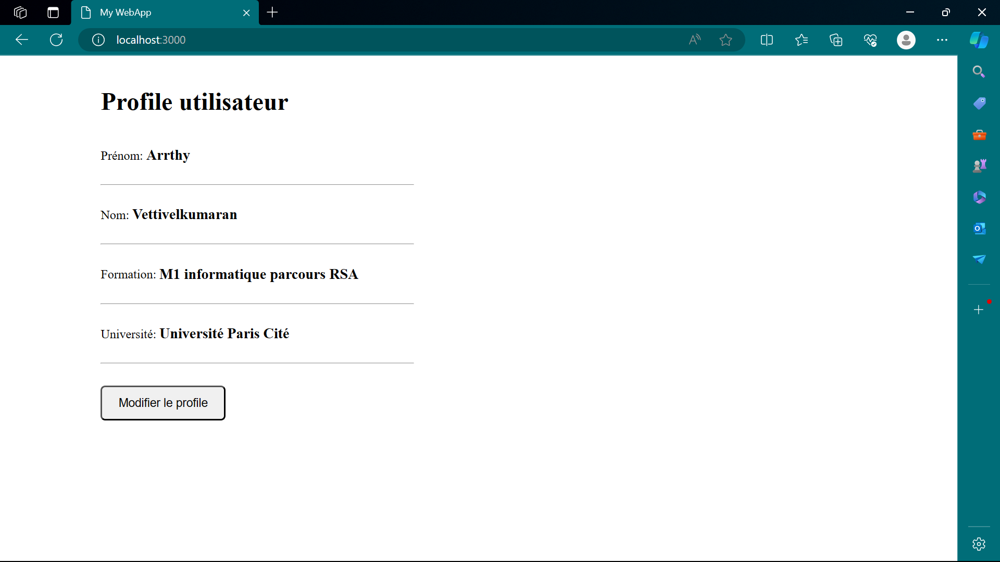

# Projet programmation distribuée
Lien images dockerhub: [image docker](https://hub.docker.com/repositories/varrthy)

### 1/. Création d’un service 
L'application web que j'ai créer s’appelle ‘mywebapp’. C'est une application toute simple qui affiche le profil d’un utilisateur. 
voici le rendu : 
  
J’ai choisi d’écrire un script en JavaScript pour lancer l’application et un script en HTML pour créer l’interface de l’application.

### 2/. Docker image 
Mon image s’appelle ‘mywebapp’. L'image déposée sur Docker Hub s’appelle ‘varrthy/mywebapp’.
lien image varrthy/mywebapp : [image varrthy/mywebapp](https://hub.docker.com/repository/docker/varrthy/mywebapp)

### 3/. déployer et ajouter un service Kubernetes
Voici ce que j'ai trouvé en tapant la commande ‘ minikube service mywebapp  –url ’ une fois que j'ai crée un service kubernete avec l'image deployée :  
  

### 4/. Ajouter une gateway 
Une fois le fichier ingress.yml modifer et le ficher host modifiée en tapant http://mywebapp.info sur la bar de recherche du browser nous trouvons : 
  

### 5/. Ajouter un deuxième service en local 
Pour cette partie j’ai décidé de crée deux services dans le langage javascript en me basant sur les services proposés par le professeur. J'ai donc créé d’abord un service qui affiche :  
  
Et un second qui affiche :  
  
En créant des services sur kubernetes avec les images deployées nous obtenons ceci:  
  

